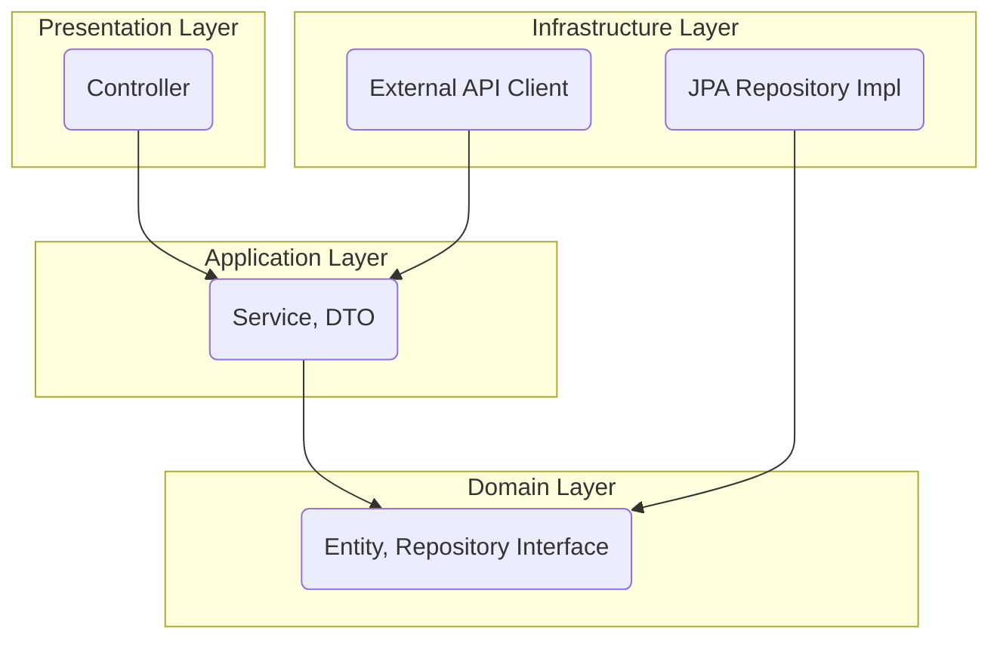

# Spring Boot 기반 커머스 플랫폼 포트폴리오

**DDD와 클린 아키텍처를 적용하여 확장성과 테스트 용이성을 확보한 커머스 백엔드 MVP**

           

---

## 📖 1. 프로젝트 개요

### 프로젝트 목표
본 프로젝트는 단순한 CRUD 기능을 넘어, 실제 서비스 수준의 확장성과 유지보수성을 고려한 백엔드 시스템을 설계하고 구현하는 역량을 기르는 것을 목표로 합니다. 이를 위해 **도메인 주도 설계(DDD)와 클린 아키텍처**를 학습하고 적용하여, 변화에 유연하게 대응할 수 있는 소프트웨어를 만드는 데 집중했습니다.

### 왜 이 프로젝트를 선택했는가?
커머스 플랫폼은 인증, 상품, 주문, 결제 등 백엔드 개발자에게 필요한 다양한 기술적 과제를 종합적으로 다룰 수 있는 훌륭한 주제라고 생각했습니다. 특히 복잡한 비즈니스 로직을 **어떻게 도메인 모델로 녹여낼 것인가**에 대한 고민과, **안전한 인증 시스템(OAuth 2.0, JWT)을 직접 구축**하는 경험을 통해 실무 역량을 쌓고자 했습니다.

---

## 🛠️ 2. 기술 스택

| 구분 | 기술 | 상세 내용 |
| :--- | :--- | :--- |
| **Backend** | `Java 17`, `Spring Boot 3.x`, `Gradle` | 안정적인 개발 환경과 강력한 생태계를 기반으로 백엔드를 구축했습니다. |
| **Database** | `MySQL 8.0` | 관계형 데이터 관리를 위해 널리 사용되는 MySQL을 선택했습니다. |
| **Data Access**| `Spring Data JPA` / `Hibernate` | ORM 기술을 활용하여 객체 지향적으로 데이터를 관리하고 생산성을 높였습니다. |
| **Authentication**|`Spring Security`, `OAuth 2.0`, `JWT` | 소셜 로그인과 토큰 기반 인증을 구현하여 보안성과 사용자 편의성을 모두 확보했습니다. |
| **Testing** | `JUnit 5`, `Mockito` | **`Mockito`를 이용한 단위 테스트로 서비스 로직의 안정성을 검증했습니다.** |

---

## 🏛️ 3. 아키텍처

프로젝트의 안정성과 확장성을 위해 **클린 아키텍처**를 채택했습니다. 각 계층의 역할을 명확히 분리하고, 의존성 규칙(안쪽으로만 의존)을 준수하여 핵심 비즈니스 로직인 **도메인 계층을 외부 변화로부터 보호**하도록 설계했습니다.

* **Domain**: 시스템의 심장부로, 순수한 비즈니스 로직과 규칙을 담고 있습니다.
* **Application**: 도메인 객체들을 조합하여 실제 사용 사례(Use Case)를 구현합니다.
* **Presentation**: 외부(클라이언트)와의 상호작용을 담당합니다.
* **Infrastructure**: 데이터베이스, 외부 API 등 외부 기술과의 연동을 책임집니다.

---

## 🗄️ 4. ERD

## ✨ 5. 주요 기능

*(현재 서버가 배포되어 있지 않으므로, 각 기능은 GIF나 스크린샷으로 대체하여 보여주는 것을 권장합니다.)*

### 1) 소셜 로그인 및 JWT 기반 Stateless 인증
-   OAuth 2.0 계정 통합: Google, Naver, Kakao 로그인 시 동일 이메일은 하나의 계정으로 통합하여 중복 가입을 방지합니다.
-   JWT 토큰 발급: 로그인 성공 시, Access Token과 Refresh Token을 발급합니다.
-   **토큰 재발급 시스템**: Access Token 만료 시 Refresh Token을 이용한 자동 갱신 API를 구현했습니다.
-   **서버 측 토큰 관리**: Refresh Token을 DB에 저장하여 서버에서 중앙 관리하고, 로그아웃 시 즉시 무효화하여 보안을 강화했습니다.
-   안전한 토큰 관리: XSS 공격 방지를 위해 가장 중요한 Refresh Token은 HttpOnly 쿠키에 저장하고, Access Token만 JSON 응답으로 전달하여 보안을 강화했습니다.
-   API 접근 제어: JwtAuthenticationFilter를 통해 API 요청 헤더의 Access Token을 검증하고, 유효한 토큰을 가진 사용자만 보호된 리소스에 접근할 수 있도록 인가 처리를 구현했습니다.

### 2) 커서 기반 페이지네이션을 이용한 상품 조회
-   모바일 환경의 '무한 스크롤'에 최적화된 커서 기반 페이지네이션을 구현했습니다.
-   데이터가 많아져도 일정한 조회 성능을 보장하여 사용자에게 끊김 없는 탐색 경험을 제공합니다.

### 3) 주문 시스템 및 재고 관리
-   **완전한 주문 프로세스**: 주문 생성, 조회, 취소, 상태 변경 기능을 구현했습니다.
-   **동시성 제어**: Pessimistic Lock을 통한 재고 차감 Race Condition 해결로 다중 사용자 주문 시 안전성을 보장합니다.
-   **재고 자동 관리**: 주문 시 재고 자동 차감, 취소 시 재고 복구 로직을 도메인 엔티티에서 처리합니다.
-   **주문 상태 관리**: PENDING, CONFIRMED, PREPARING, SHIPPED, DELIVERED, CANCELLED, REFUNDED 상태를 지원합니다.
-   **권한 기반 접근 제어**: 본인 주문만 조회/취소 가능하며, 관리자만 주문 상태 변경이 가능합니다.
-   **도메인 중심 설계**: Order, OrderItem 엔티티에 비즈니스 로직을 집중하여 유지보수성을 향상시켰습니다.
-   **페이징 지원**: 사용자 주문 목록 조회 시 커서 기반 페이징을 지원합니다.

### 4) 장바구니 시스템
-   **완전한 장바구니 기능**: 아이템 추가/수정/삭제/조회, 장바구니 비우기 기능을 구현했습니다.
-   **동시성 제어**: Pessimistic Lock을 통한 Race Condition 해결로 다중 사용자가 동시에 같은 상품을 장바구니에 추가해도 안전합니다.
-   **재고 관리**: 재고 부족 아이템 자동 감지 및 제거 기능으로 사용자 경험을 향상시켰습니다.
-   **장바구니 요약 정보**: 총 아이템 수, 총 금액, 재고 상태 등을 한 번에 조회할 수 있습니다.
-   **이벤트 기반 주문 연동**: 장바구니에서 주문 생성 시 이벤트를 통한 느슨한 결합으로 장바구니 자동 비우기를 구현했습니다.
-   **권한 기반 접근 제어**: @PreAuthorize를 통한 자동 권한 검증으로 보안을 강화했습니다.
-   **N+1 문제 해결**: @EntityGraph를 활용한 fetch join으로 성능을 최적화했습니다.

### 5) 전역 예외 처리 및 표준화된 에러 응답
-   **GlobalExceptionHandler**를 구현하여 일관된 에러 응답 형식을 제공합니다.
-   **BusinessException**과 **ErrorCode** 체계를 구축하여 비즈니스 로직 예외를 체계적으로 관리합니다.
-   인증, 검증, 서버 오류 등 다양한 예외 상황에 대한 적절한 HTTP 상태 코드와 에러 메시지를 반환합니다.

### 6) 입력값 검증 및 유효성 검사
-   **Spring Validation**을 활용하여 API 입력값에 대한 검증을 강화했습니다.
-   DTO에 `@NotBlank`, `@Min`, `@Max` 등의 어노테이션을 적용하여 데이터 무결성을 보장합니다.
-   검증 실패 시 명확한 에러 메시지를 제공하여 개발자와 사용자 경험을 개선했습니다.

### 7) 이벤트 기반 아키텍처 및 AOP 활용
-   **이벤트 기반 아키텍처**: 주문 완료 시 이벤트 발행을 통한 느슨한 결합 구현
-   **비동기 이벤트 처리**: @Async를 활용한 비동기 이벤트 처리로 성능 향상
-   **AOP 기반 권한 검증**: @PreAuthorize를 통한 자동 권한 검증으로 보안 강화
-   **@AuthenticationPrincipal**: 모든 컨트롤러에 일관된 사용자 인증 방식 적용

---

## 🙋‍♂️ 6. 나의 역할 및 기여 (1인 프로젝트)

본 프로젝트는 1인 개발로 진행되었으며, 모든 단계에서 주도적으로 설계와 개발을 책임졌습니다. 특히 아래와 같은 문제들을 해결하는 과정에서 깊이 고민했습니다.

### Problem & Solution 1: OAuth 2.0 계정 중복 가입 문제
-   **문제**: 동일한 이메일을 사용하는 유저가 네이버로 가입 후, 다시 카카오로 로그인하면 `email` UNIQUE 제약조건 위반 에러가 발생했습니다.
-   **해결**: 사용자 식별 기준을 `(provider, providerId)`가 아닌 `email`로 변경했습니다. `CustomOAuth2UserService`에서 로그인 시 `email`로 기가입 유무를 먼저 확인하고, **기존 회원이면 정보를 업데이트하고, 신규 회원이면 새로 등록**하도록 로직을 개선하여 문제를 해결했습니다.

### Problem & Solution 2: 대용량 데이터 조회 성능 저하 문제
-   **문제**: 일반적인 오프셋 페이지네이션은 데이터가 수백만 건 이상일 때 뒤 페이지로 갈수록 조회 속도가 급격히 저하될 수 있습니다. (개념을 배워서 적용해봤습니다.)
-   **해결**: 마지막 조회 결과의 ID를 '커서'로 사용하여 "이 ID 다음부터 N개를 조회해줘" 방식으로 동작하는 **커서 기반 페이지네이션**을 구현했습니다. 이를 통해 **조회 성능을 O(1)에 가깝게 유지**하여 확장성을 확보했습니다.

### Problem & Solution 3: Stateless API 인증 시스템 구축
-   **문제**: 세션 기반 인증은 서버의 확장성에 불리하고, 모바일 앱 등 다양한 클라이언트 환경에 유연하게 대응하기 어렵습니다.
-   **해결**: JWT를 도입하여 Stateless 인증 시스템을 구축했습니다. JwtAuthenticationFilter를 통해 토큰을 검증하고 SecurityContext에 인증 정보를 등록하는 흐름을 직접 구현했습니다. 특히, Refresh Token을 HttpOnly 쿠키에 저장하여 XSS 공격으로부터 토큰을 안전하게 보호하는 보안 모델을 적용했습니다.

### Problem & Solution 4: 독립적인 테스트 환경 구축
-   **문제**: 로컬 MySQL DB와 환경 변수에 의존하는 테스트는 다른 환경에서의 실행을 보장할 수 없으며, 빌드 실패의 원인이 되었습니다.
-   **해결**: **src/test/resources**에 테스트 전용 application.yml을 구성하고, H2 인메모리 데이터베이스를 사용하도록 설정했습니다. 이를 통해 외부 환경에 의존하지 않는, 빠르고 독립적인 테스트 환경을 구축하여 빌드 안정성을 확보했습니다.

### Problem & Solution 5: JWT 토큰 재발급 시스템 구현
-   **문제**: Access Token의 짧은 만료 시간으로 인한 사용자 경험 저하와 보안성 확보 사이의 균형이 필요했습니다.
-   **해결**: Refresh Token을 이용한 Access Token 재발급 시스템을 구현했습니다. HttpOnly 쿠키를 통한 안전한 Refresh Token 관리와 함께, 토큰 재발급 시 새로운 Refresh Token도 함께 발급하여 보안성을 강화했습니다.

### Problem & Solution 6: 일관된 에러 처리 시스템 구축
-   **문제**: 다양한 예외 상황에 대한 일관되지 않은 에러 응답과 개발자 경험의 불편함이 있었습니다.
-   **해결**: GlobalExceptionHandler를 구현하여 모든 예외를 중앙에서 처리하고, BusinessException과 ErrorCode 체계를 통해 일관된 에러 응답 형식을 제공했습니다. 이를 통해 API 사용자와 개발자 모두에게 명확한 에러 정보를 제공할 수 있게 되었습니다.

### Problem & Solution 7: JWT 토큰 보안 강화 및 서버 측 관리
-   **문제**: Refresh Token이 클라이언트에만 저장되어 있어, 토큰 탈취 시 만료 시간까지 계속 사용될 수 있는 보안 위험이 있었습니다.
-   **해결**: Refresh Token을 DB에 저장하여 서버에서 중앙 관리하고, 로그아웃 시 즉시 무효화하는 시스템을 구현했습니다. 또한 Access Token만 JSON 응답으로 전달하고 Refresh Token은 HttpOnly 쿠키에만 저장하여 보안을 강화했습니다.

### Problem & Solution 8: 주문 시스템 및 재고 관리 구현
-   **문제**: 커머스 플랫폼의 핵심인 주문 처리와 재고 관리 시스템이 필요했습니다.
-   **해결**: 완전한 주문 프로세스(생성, 조회, 취소, 상태 변경)를 구현하고, 주문 시 재고 자동 차감, 취소 시 재고 복구 로직을 추가했습니다. 또한 주문 상태별 관리와 사용자별 권한 제어를 통해 안전하고 효율적인 주문 시스템을 구축했습니다.

### Problem & Solution 9: 동시성 제어 및 도메인 중심 설계 개선
-   **문제**: 다중 사용자 동시 주문 시 재고 차감 Race Condition, 서비스 계층의 과도한 책임, 관리자 권한 검증 부재 등의 문제가 있었습니다.
-   **해결**: Pessimistic Lock을 통한 동시성 제어로 Race Condition을 해결하고, 도메인 엔티티에 비즈니스 로직을 집중시켜 단일 책임 원칙을 준수했습니다. 또한 AuthorizationUtils를 통한 체계적인 권한 검증 시스템을 구축하여 보안을 강화했습니다.

### Problem & Solution 10: 장바구니 시스템 구현 및 주문 연동
-   **문제**: 사용자가 여러 상품을 한 번에 주문할 수 있는 장바구니 기능과 주문 시스템과의 연동이 필요했습니다.
-   **해결**: 완전한 장바구니 시스템을 구현하여 아이템 추가/수정/삭제/조회 기능을 제공하고, 재고 부족 아이템 자동 감지 및 제거 기능을 추가했습니다. 또한 장바구니에서 바로 주문 생성이 가능하도록 주문 시스템과 연동하여 사용자 경험을 향상시켰습니다.

### Problem & Solution 11: 이벤트 기반 아키텍처 및 AOP 활용
-   **문제**: 장바구니와 주문 시스템 간의 강결합, 수동 권한 검증으로 인한 보안 누락 위험, N+1 문제로 인한 성능 저하 등의 문제가 있었습니다.
-   **해결**: 이벤트 기반 아키텍처를 도입하여 주문 완료 시 이벤트 발행을 통한 느슨한 결합을 구현했습니다. @PreAuthorize를 통한 AOP 기반 자동 권한 검증으로 보안을 강화하고, @EntityGraph를 활용한 fetch join으로 N+1 문제를 해결했습니다. 또한 @AuthenticationPrincipal을 모든 컨트롤러에 적용하여 일관된 사용자 인증 방식을 구축했습니다.

---

## 📈 7. 결과 및 성과

-   **유지보수성이 높은 코드 구조 설계**: 클린 아키텍처를 적용하여 각 계층이 명확히 분리된, 테스트와 기능 확장이 용이한 백엔드 시스템을 구축했습니다.
-   **안전하고 편리한 인증 시스템 구현**: OAuth 2.0과 JWT의 동작 원리를 깊이 이해하고, Stateless 인증, 토큰 재발급, 서버 측 토큰 관리를 고려한 보안 모델까지 적용하여 실무 수준의 인증 서버 로직을 성공적으로 구현했습니다.
-   **견고한 에러 처리 시스템**: GlobalExceptionHandler와 BusinessException 체계를 통해 일관된 에러 응답을 제공하고, 개발자 경험을 크게 개선했습니다.
-   **입력값 검증 강화**: Spring Validation을 활용하여 데이터 무결성을 보장하고, API의 안정성을 크게 향상시켰습니다.
-   **보안 강화된 토큰 관리**: Refresh Token을 DB에 저장하여 서버에서 중앙 관리하고, 로그아웃 시 즉시 무효화하는 시스템을 구현하여 토큰 탈취 위험을 최소화했습니다.
-   **완전한 커머스 주문 시스템**: 주문 생성부터 배송 완료까지의 전체 프로세스를 구현하고, 재고 자동 관리와 상태별 권한 제어를 통해 실무 수준의 주문 시스템을 구축했습니다.
-   **동시성 제어 및 도메인 중심 설계**: Pessimistic Lock을 통한 Race Condition 해결과 도메인 엔티티 중심의 비즈니스 로직 설계로 확장 가능하고 안전한 시스템을 구축했습니다.
-   **완전한 장바구니 시스템**: 사용자 친화적인 장바구니 기능과 주문 시스템과의 완벽한 연동을 통해 실무 수준의 커머스 플랫폼을 완성했습니다.
-   **이벤트 기반 아키텍처 및 AOP 활용**: 이벤트 기반 아키텍처를 통한 느슨한 결합, AOP 기반 자동 권한 검증, N+1 문제 해결, 일관된 사용자 인증 방식 구축을 통해 확장 가능하고 유지보수성이 높은 시스템을 구축했습니다.
-   **실무적인 문제 해결 능력 입증**: 단순 기능 구현을 넘어, 페이지네이션 성능 최적화, 계정 통합, 테스트 환경 구축, 토큰 재발급 시스템, 보안 강화, 주문 시스템, 동시성 제어, 장바구니 시스템, 이벤트 기반 아키텍처, AOP 활용 등 실제 서비스에서 마주할 수 있는 문제들을 주도적으로 정의하고 해결했습니다.

---

## 📚 8. 프로젝트를 통해 배운 점 및 향후 계획

-   **배운 점**: 도메인을 중심으로 설계하는 것이 왜 중요한지, 그리고 외부 기술에 의존하지 않는 순수한 비즈니스 로직을 만드는 것이 시스템의 수명을 어떻게 늘려주는지 체감할 수 있었습니다. 또한 일관된 에러 처리와 입력값 검증이 API의 안정성과 사용자 경험에 미치는 영향을 깊이 이해할 수 있었습니다. 특히 이벤트 기반 아키텍처와 AOP를 활용한 관점 지향 프로그래밍이 코드의 결합도를 낮추고 확장성을 높이는 데 얼마나 효과적인지 실감할 수 있었습니다.
-   **향후 계획**:
    1.  **단위 테스트 및 통합 테스트 코드 작성**: 설계한 구조의 이점을 살려, 각 계층별로 견고한 테스트 코드를 작성하여 시스템의 안정성을 높일 것입니다.
    2.  **결제 시스템 연동**: 토스페이먼츠 또는 카카오페이를 연동하여 실제 결제 처리가 가능한 완전한 커머스 플랫폼을 구축할 계획입니다.
    3.  **캐싱 시스템 도입**: Redis를 활용한 캐싱으로 성능을 최적화할 예정입니다.
    4.  **API 문서화**: Swagger/OpenAPI를 통한 자동 문서 생성으로 개발자 경험을 개선할 계획입니다.
