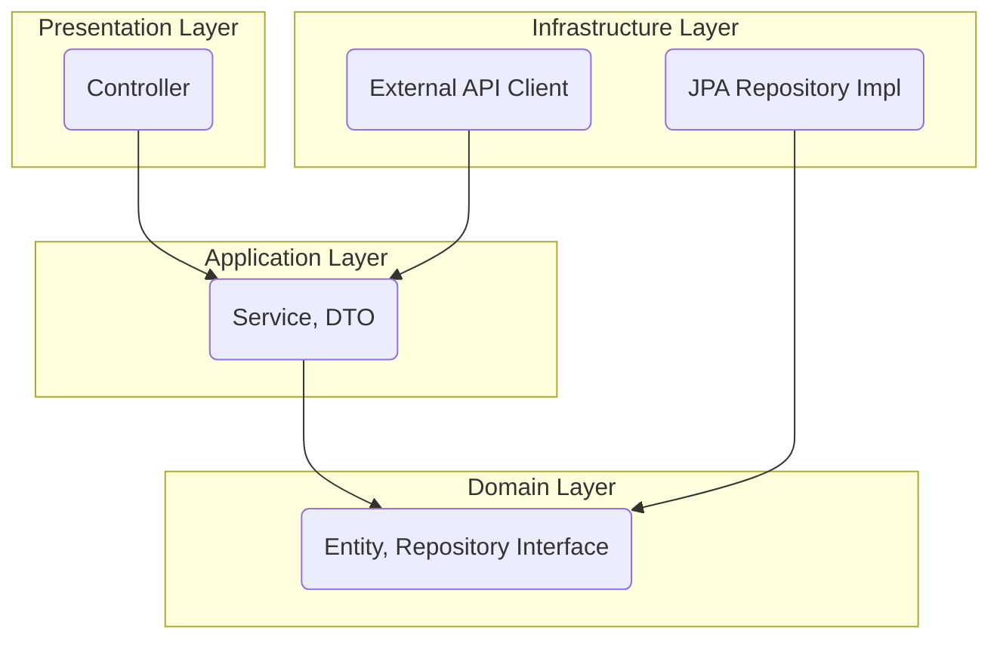

# Spring Boot 기반 커머스 플랫폼 포트폴리오

**DDD와 클린 아키텍처를 적용하여 확장성과 테스트 용이성을 확보한 커머스 백엔드 MVP**

     

---

## 📖 1. 프로젝트 개요

### 프로젝트 목표
본 프로젝트는 단순한 CRUD 기능을 넘어, 실제 서비스 수준의 확장성과 유지보수성을 고려한 백엔드 시스템을 설계하고 구현하는 역량을 기르는 것을 목표로 합니다. 이를 위해 **도메인 주도 설계(DDD)와 클린 아키텍처**를 학습하고 적용하여, 변화에 유연하게 대응할 수 있는 소프트웨어를 만드는 데 집중했습니다.

### 왜 이 프로젝트를 선택했는가?
커머스 플랫폼은 인증, 상품, 주문, 결제 등 백엔드 개발자에게 필요한 다양한 기술적 과제를 종합적으로 다룰 수 있는 훌륭한 주제라고 생각했습니다. 특히 복잡한 비즈니스 로직을 **어떻게 도메인 모델로 녹여낼 것인가**에 대한 고민과, **안전한 인증 시스템(OAuth 2.0, JWT)을 직접 구축**하는 경험을 통해 실무 역량을 쌓고자 했습니다.

---

## 🛠️ 2. 기술 스택

| 구분 | 기술 | 상세 내용 |
| :--- | :--- | :--- |
| **Backend** | `Java 17`, `Spring Boot 3.x`, `Gradle` | 안정적인 개발 환경과 강력한 생태계를 기반으로 백엔드를 구축했습니다. |
| **Database** | `MySQL 8.0` | 관계형 데이터 관리를 위해 널리 사용되는 MySQL을 선택했습니다. |
| **Data Access** | `Spring Data JPA` / `Hibernate` | ORM 기술을 활용하여 객체 지향적으로 데이터를 관리하고 생산성을 높였습니다. |
| **Authentication** | `Spring Security`, `OAuth 2.0`, `JWT` | 소셜 로그인과 토큰 기반 인증을 구현하여 보안성과 사용자 편의성을 모두 확보했습니다. |

---

## 🏛️ 3. 아키텍처

프로젝트의 안정성과 확장성을 위해 **클린 아키텍처**를 채택했습니다. 각 계층의 역할을 명확히 분리하고, 의존성 규칙(안쪽으로만 의존)을 준수하여 핵심 비즈니스 로직인 **도메인 계층을 외부 변화로부터 보호**하도록 설계했습니다.


* **Domain**: 시스템의 심장부로, 순수한 비즈니스 로직과 규칙을 담고 있습니다.
* **Application**: 도메인 객체들을 조합하여 실제 사용 사례(Use Case)를 구현합니다.
* **Presentation**: 외부(클라이언트)와의 상호작용을 담당합니다.
* **Infrastructure**: 데이터베이스, 외부 API 등 외부 기술과의 연동을 책임집니다.

---

## 🗄️ ERD

```mermaid
erDiagram
    MEMBER ||--o{ ORDERS : "places"
    MEMBER ||--|{ CART : "has"
    MEMBER {
        bigint member_id PK
        varchar(255) email UK
        varchar(255) password
        varchar(255) name
        varchar(255) address
        varchar(50) role
        varchar(50) provider
        varchar(50) provider_id
        datetime created_at
        datetime updated_at
    }

    ORDERS ||--o{ ORDER_ITEM : "contains"
    ORDERS ||--|{ PAYMENT : "is paid by"
    ORDERS {
        bigint order_id PK
        bigint member_id FK
        varchar(255) order_number UK
        int total_price
        varchar(50) status
        datetime created_at
        datetime updated_at
    }

    ORDER_ITEM {
        bigint order_item_id PK
        bigint order_id FK
        bigint product_id FK
        int order_price
        int quantity
        datetime created_at
        datetime updated_at
    }

    PRODUCT ||--o{ ORDER_ITEM : "included in"
    PRODUCT ||--o{ CART_ITEM : "added to"
    PRODUCT {
        bigint product_id PK
        varchar(255) name
        int price
        int stock
        varchar(255) image_url
        varchar(255) naver_product_id
        datetime created_at
        datetime updated_at
    }

    CART ||--o{ CART_ITEM : "contains"
    CART {
        bigint cart_id PK
        bigint member_id FK
        datetime created_at
        datetime updated_at
    }

    CART_ITEM {
        bigint cart_item_id PK
        bigint cart_id FK
        bigint product_id FK
        int quantity
        datetime created_at
        datetime updated_at
    }

    PAYMENT {
        bigint payment_id PK
        bigint order_id FK
        varchar(255) payment_key UK
        int amount
        varchar(50) status
        datetime created_at
        datetime updated_at
    }

## ✨ 4. 주요 기능

*(현재 서버가 배포되어 있지 않으므로, 각 기능은 GIF나 스크린샷으로 대체하여 보여주는 것을 권장합니다.)*

### 1) 소셜 로그인 및 계정 통합
-   Google, Naver, Kakao 계정을 이용한 OAuth 2.0 기반의 간편 로그인을 제공합니다.
-   서로 다른 소셜 계정이라도 **이메일이 같다면 하나의 계정으로 통합**하여 중복 가입을 방지하고 사용자 경험을 개선했습니다.


### 2) 커서 기반 페이지네이션을 이용한 상품 조회
-   모바일 환경의 '무한 스크롤'에 최적화된 커서 기반 페이지네이션을 구현했습니다.
-   데이터가 많아져도 일정한 조회 성능을 보장하여 사용자에게 끊김 없는 탐색 경험을 제공합니다.


---

## 🙋‍♂️ 5. 나의 역할 및 기여 (1인 프로젝트)

본 프로젝트는 1인 개발로 진행되었으며, 모든 단계에서 주도적으로 설계와 개발을 책임졌습니다. 특히 아래와 같은 문제들을 해결하는 과정에서 깊이 고민했습니다.

### Problem & Solution 1: OAuth 2.0 계정 중복 가입 문제
-   **문제**: 동일한 이메일을 사용하는 유저가 네이버로 가입 후, 다시 카카오로 로그인하면 `email` UNIQUE 제약조건 위반 에러가 발생했습니다.
-   **해결**: 사용자 식별 기준을 `(provider, providerId)`가 아닌 `email`로 변경했습니다. `CustomOAuth2UserService`에서 로그인 시 `email`로 기가입 유무를 먼저 확인하고, **기존 회원이면 정보를 업데이트하고, 신규 회원이면 새로 등록**하도록 로직을 개선하여 문제를 해결했습니다.

### Problem & Solution 2: 대용량 데이터 조회 성능 저하 문제
-   **문제**: 일반적인 오프셋 페이지네이션은 데이터가 수백만 건 이상일 때 뒤 페이지로 갈수록 조회 속도가 급격히 저하될 수 있습니다.
-   **해결**: 마지막 조회 결과의 ID를 '커서'로 사용하여 "이 ID 다음부터 N개를 조회해줘" 방식으로 동작하는 **커서 기반 페이지네이션**을 구현했습니다. 이를 통해 **조회 성능을 O(1)에 가깝게 유지**하여 확장성을 확보했습니다.

---

## 📈 6. 결과 및 성과

-   **유지보수성이 높은 코드 구조 설계**: 클린 아키텍처를 적용하여 각 계층이 명확히 분리된, 테스트와 기능 확장이 용이한 백엔드 시스템을 구축했습니다.
-   **안전하고 편리한 인증 시스템 구현**: OAuth 2.0과 JWT의 동작 원리를 깊이 이해하고, 다양한 소셜 로그인을 통합 관리하는 인증 서버 로직을 성공적으로 구현했습니다.
-   **실무적인 문제 해결 능력 입증**: 단순 기능 구현을 넘어, 페이지네이션 성능 최적화, 계정 통합 등 실제 서비스에서 마주할 수 있는 문제들을 주도적으로 정의하고 해결했습니다.

---

## 📚 7. 프로젝트를 통해 배운 점 및 향후 계획

-   **배운 점**: 도메인을 중심으로 설계하는 것이 왜 중요한지, 그리고 외부 기술에 의존하지 않는 순수한 비즈니스 로직을 만드는 것이 시스템의 수명을 어떻게 늘려주는지 체감할 수 있었습니다.
-   **향후 계획**:
    1.  **JWT 인증 시스템 구현**: 현재 로그인만 구현된 상태에서, Access/Refresh Token을 발급하여 API 접근을 제어하는 로직을 완성할 예정입니다.
    2.  **단위 테스트 및 통합 테스트 코드 작성**: 설계한 구조의 이점을 살려, 각 계층별로 견고한 테스트 코드를 작성하여 시스템의 안정성을 높일 것입니다.
    3.  **주문/결제 기능 구현**: 커머스의 핵심 기능인 주문 및 결제 로직을 추가하여 프로젝트를 완성할 계획입니다.
